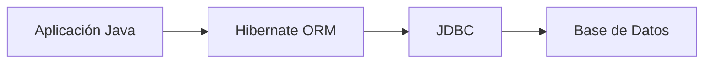
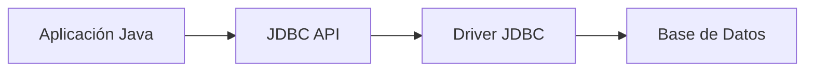

# Hibernate y JPA: Conceptos Fundamentales

## ¿Qué es Hibernate?
Hibernate es un framework de mapeo objeto-relacional (ORM) para Java. Permite mapear clases Java a tablas de bases de datos relacionales y viceversa, facilitando la persistencia de datos de manera transparente.

### Beneficios de Hibernate
- **Abstracción de SQL:** Permite trabajar con objetos Java sin escribir SQL manualmente.
- **Portabilidad:** Soporta múltiples bases de datos sin cambiar el código.
- **Gestión de transacciones:** Maneja transacciones y conexiones automáticamente.
- **Caché:** Mejora el rendimiento mediante caché de primer y segundo nivel.
- **Lazy Loading:** Carga diferida de datos para optimizar recursos.

### Casos de uso
- Aplicaciones empresariales Java que requieren persistencia de datos.
- Sistemas donde se necesita desacoplar la lógica de negocio del acceso a datos.

### Ventajas
- Reducción de código repetitivo.
- Independencia de la base de datos.
- Integración con Spring y otros frameworks.

### Desventajas
- Curva de aprendizaje inicial.
- Overhead de configuración.
- Puede ocultar detalles importantes de SQL.

### Diagrama: Comunicación Java ↔ DB con Hibernate


---

## ¿Qué es un ORM?
Un ORM (Object-Relational Mapping) es una técnica que permite convertir datos entre sistemas incompatibles usando lenguajes orientados a objetos y bases de datos relacionales. Facilita el trabajo con datos persistentes usando objetos en lugar de tablas y registros.

---

## ¿Qué es JPA (Jakarta Persistence API)?
JPA es una especificación estándar de Java para la persistencia de datos. Define un conjunto de reglas y anotaciones para mapear objetos Java a tablas de bases de datos. JPA no es una implementación, sino una API; Hibernate es uno de sus implementadores más populares.

### Beneficios de JPA
- **Estandarización:** Código portable entre diferentes implementaciones.
- **Integración:** Compatible con frameworks modernos como Spring Boot.
- **Facilidad de uso:** Uso de anotaciones para definir entidades y relaciones.

### Vendors (Proveedores/Implementadores)
- **Hibernate** (más popular)
- **EclipseLink**
- **OpenJPA**
- **DataNucleus**

---

## ¿Qué es CRUD?
CRUD es el acrónimo de las operaciones básicas de persistencia de datos:
- **Create:** Crear registros.
- **Read:** Leer registros.
- **Update:** Actualizar registros.
- **Delete:** Eliminar registros.

Estas operaciones son fundamentales en cualquier aplicación que maneje datos persistentes.

---

## ¿Qué es JDBC?
JDBC (Java Database Connectivity) es una API de Java que permite la comunicación entre aplicaciones Java y bases de datos relacionales mediante SQL. JDBC proporciona las clases y métodos para conectar, ejecutar consultas y manejar resultados.

### Rol de JDBC en Hibernate/JPA
Hibernate y JPA utilizan JDBC internamente para interactuar con la base de datos. El desarrollador trabaja con entidades y repositorios, mientras que el framework traduce estas operaciones a SQL y las ejecuta usando JDBC.

### Diagrama: Comunicación con JDBC


---

## Configuración de JDBC en Spring Boot

En una aplicación Spring Boot, la configuración de JDBC se realiza principalmente en el archivo `application.properties` o `application.yml`. Aquí se definen los parámetros de conexión a la base de datos, el driver JDBC y otras propiedades relevantes. Spring Boot autoconfigura el DataSource y gestiona la conexión.

### Ejemplo de configuración en `application.properties` para MySQL 9.4

```properties
# Configuración de la URL de conexión JDBC
spring.datasource.url=jdbc:mysql://localhost:3306/mi_base_de_datos?useSSL=false&serverTimezone=UTC

# Usuario y contraseña de la base de datos
spring.datasource.username=usuario
spring.datasource.password=contraseña

# Driver JDBC de MySQL
spring.datasource.driver-class-name=com.mysql.cj.jdbc.Driver

# Dialecto de Hibernate para MySQL
spring.jpa.properties.hibernate.dialect=org.hibernate.dialect.MySQLDialect

# Mostrar SQL generado por Hibernate
spring.jpa.show-sql=true

# Estrategia de creación de tablas
spring.jpa.hibernate.ddl-auto=update
```

Con esta configuración, Spring Boot crea automáticamente el DataSource y gestiona la conexión JDBC, permitiendo el uso de JPA/Hibernate para la persistencia de datos.

---

## Referencias
- [Documentación oficial de Hibernate](https://hibernate.org/orm/documentation/)
- [Documentación oficial de JPA (Jakarta Persistence)](https://jakarta.ee/specifications/persistence/)
- [¿Qué es un ORM?](https://es.wikipedia.org/wiki/Mapeo_objeto-relacional)
- [JDBC en Oracle](https://docs.oracle.com/javase/tutorial/jdbc/overview/index.html)
- [Spring Data JPA](https://spring.io/projects/spring-data-jpa)
