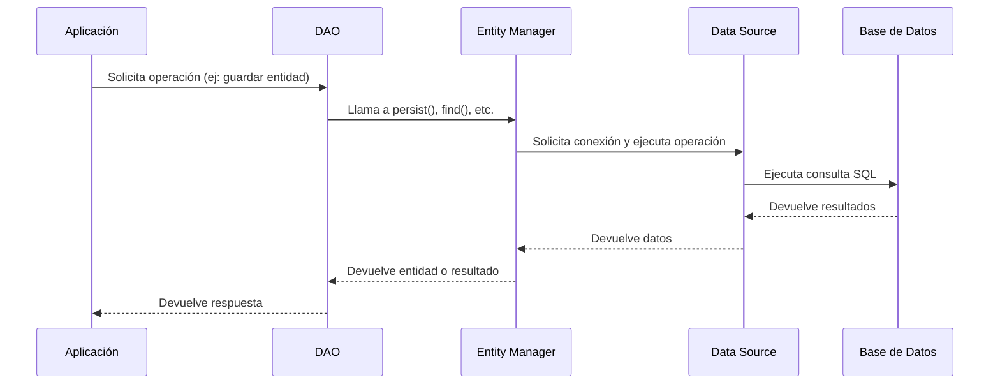

# JPA Entity Manager

## ¿Qué es JPA Entity Manager?
El **Entity Manager** es el componente principal de JPA (Jakarta Persistence API) encargado de gestionar el ciclo de vida de las entidades, así como de realizar operaciones de persistencia y consultas sobre la base de datos. Proporciona una API para interactuar con el contexto de persistencia y abstrae los detalles de acceso a los datos.

## ¿Para qué se utiliza?
El Entity Manager se utiliza para:
- Crear, leer, actualizar y eliminar entidades (operaciones CRUD).
- Gestionar el ciclo de vida de las entidades (persistencia, actualización, eliminación, etc.).
- Ejecutar consultas JPQL, SQL nativo y consultas con criterios.
- Sincronizar el estado de las entidades con la base de datos.

## Requisitos necesarios para utilizar Entity Manager
- Tener configurado un proveedor de JPA (por ejemplo, Hibernate) en el proyecto.
- Definir una unidad de persistencia (`persistence.xml`) o utilizar la configuración de Spring Boot 4 en `application.properties` o `application.yml`.
- Tener las entidades JPA correctamente anotadas con `@Entity`.
- Inyectar o crear una instancia de `EntityManager` en la clase DAO o repositorio.

## ¿Cómo se utiliza con el patrón DAO?
En el patrón DAO, el Entity Manager se utiliza como el mecanismo principal para interactuar con la base de datos. El DAO recibe una instancia de Entity Manager (por inyección de dependencias o manualmente) y utiliza sus métodos para realizar operaciones sobre las entidades.

### Ejemplo de uso en un DAO (pseudocódigo):
```java
@Repository
public class UsuarioDAO {
    @PersistenceContext
    private EntityManager entityManager;

    public Usuario findById(Long id) {
        return entityManager.find(Usuario.class, id);
    }
    // Otros métodos CRUD usando entityManager
}
```

## Diagrama de comunicación


> **Comentario:** En aplicaciones modernas con Spring Boot 4 y Java 25, la inyección del Entity Manager se realiza automáticamente y su uso es transparente para el desarrollador, facilitando la implementación del patrón DAO.

# JPA Repository

## ¿Qué es JPA Repository?
`JPA Repository` es una interfaz de Spring Data JPA que extiende a `PagingAndSortingRepository` y, a su vez, a `CrudRepository`. Proporciona una API de alto nivel para realizar operaciones CRUD, paginación, ordenamiento y consultas personalizadas sobre entidades JPA, eliminando la necesidad de implementar manualmente la mayoría de los métodos de acceso a datos.

Spring Data JPA genera automáticamente la implementación de los métodos definidos en la interfaz del repositorio, permitiendo escribir menos código y enfocarse en la lógica de negocio.

## Comparación entre Entity Manager y JPA Repository
| Característica                | Entity Manager                                 | JPA Repository                         |
|-------------------------------|-----------------------------------------------|----------------------------------------|
| Nivel de abstracción          | Bajo (más control, más código)                | Alto (menos código, más automatización)|
| Operaciones CRUD              | Manuales, usando métodos del EntityManager    | Automáticas, métodos predefinidos      |
| Consultas personalizadas      | JPQL, SQL nativo, Criteria API                | Métodos de consulta por nombre, @Query |
| Paginación y ordenamiento     | Manual                                        | Integrado                              |
| Flexibilidad                  | Máxima                                        | Limitada a la API de repositorio       |
| Facilidad de pruebas          | Requiere mocks/manual                         | Muy sencillo con Spring Boot           |

## ¿Cuál utilizar: Entity Manager o JPA Repository?
- **JPA Repository** es ideal para la mayoría de los casos donde se requieren operaciones CRUD estándar, paginación, ordenamiento y consultas simples o moderadamente complejas. Permite desarrollar más rápido y con menos código.
- **Entity Manager** es recomendable cuando se necesita un control total sobre las operaciones de persistencia, realizar operaciones complejas, optimizaciones específicas, transacciones personalizadas o consultas avanzadas que no se pueden expresar fácilmente con la API de repositorios.

## Casos de uso para Entity Manager
- Operaciones de persistencia avanzadas o personalizadas.
- Consultas dinámicas complejas usando Criteria API.
- Manejo manual del ciclo de vida de las entidades.
- Transacciones personalizadas o gestión avanzada de contexto de persistencia.

## Casos de uso para JPA Repository
- CRUD estándar sobre entidades.
- Consultas simples o moderadas usando métodos derivados o anotaciones `@Query`.
- Paginación y ordenamiento de resultados.
- Proyectos donde se busca rapidez de desarrollo y simplicidad.

## ¿Se pueden utilizar ambos en un proyecto?
Sí, es totalmente válido y común utilizar ambos enfoques en un mismo proyecto con Spring Boot 4. Se pueden definir repositorios que extienden `JpaRepository` para la mayoría de las operaciones y, cuando sea necesario, inyectar el `EntityManager` para operaciones avanzadas o personalizadas.

> **Comentario:** Esta flexibilidad permite aprovechar la productividad de los repositorios y el poder del Entity Manager según las necesidades de cada caso. Spring Boot 4 con Java 25 mantiene plena compatibilidad con ambos enfoques.
